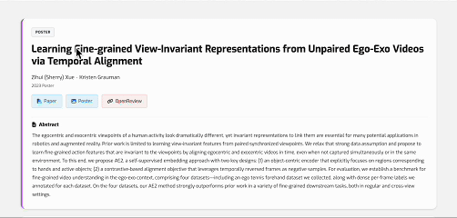

# LA-YEE Web Translate



在网页上选中文字，一点就译。

[官网](http://www.la-yee.com) · 当前版本 **v0.1.3**

LA-YEE Web Translate 是一款浏览器翻译插件，支持 Chrome 和 Microsoft Edge。选中文字后，旁边会出现「翻译」按钮，译文流式显示在页面上，不用切标签、不用复制粘贴。

---

## 安装插件（3 分钟搞定）

> 适合大多数使用者的安装步骤

### 第 1 步：下载安装包

1. 打开 **[Releases 发布页](https://github.com/pminimd/WebTranslate-extension/releases)**
2. 下载最新版的 **`web-translate-vX.X.X.zip`**（不要下载 Source code）

### 第 2 步：解压

把 zip 文件解压到任意位置，例如 `下载/web-translate/`。

解压后文件夹里应有 **`manifest.json`**。**记住这个文件夹的位置**，后面要用。

> 提示：不要只打开 zip 不解压，Chrome 无法直接加载压缩包。

### 第 3 步：加载到 Chrome

1. 打开 Chrome，地址栏输入 **`chrome://extensions/`** 回车
2. 打开右上角的 **「开发者模式」**
3. 点击 **「加载已解压的扩展程序」**
4. 选中刚才解压出来的那个文件夹
5. 完成！工具栏会出现 Web Translate 图标

<details>
<summary><strong>Microsoft Edge 用户</strong></summary>

1. 打开 **`edge://extensions/`**
2. 开启 **「开发人员模式」**
3. 点击 **「加载解压缩的扩展」**
4. 选择解压后的文件夹

</details>

### 第 4 步：固定到工具栏（推荐）

如果没看到图标，点浏览器右上角的 **拼图图标** → 找到 **Web Translate** → 点 **图钉** 固定。

---

## 注册、登录并开始使用

### 注册与登录

1. 点击工具栏上的 **Web Translate** 图标
2. 首次使用点 **「没有帐号？注册」**
3. 填写邮箱、密码；服务器地址保持默认 **`https://api.la-yee.com`**
4. 查收验证邮件，点击链接完成验证
5. 回到插件 **登录**；顶部显示 **「已连接」** 即可使用

如有好友邀请码，可在注册时填写（选填）。

### 翻译文字

**方法一：点按钮**

1. 在任意网页上 **选中一段文字**
2. 点击选区旁边出现的 **「翻译」** 按钮
3. 译文会出现在旁边的浮层里

**方法二：快捷键**

| 操作 | 快捷键 |
|------|--------|
| 翻译选中文本 | `Alt + T`（Mac：`Option + T`） |
| 关闭翻译浮层 | `Esc` |

### 切换目标语言

点击插件图标，在弹窗里选择你想翻译成的语言（默认中文）。

### 推荐给朋友

Popup 顶部可复制 **[官网链接](http://www.la-yee.com)** 分享给好友；登录后还可查看 **我的邀请码**，一键复制邀请信息。

---

## 常见问题

**选中了文字，但没有出现「翻译」按钮？**

- 刷新一下当前网页再试
- 部分页面（如 Chrome 设置页、应用商店）不支持插件运行，这是浏览器限制

**插件显示「未连接」？**

- 确认服务器地址为 **`https://api.la-yee.com`**
- 检查网络是否正常，退出登录后重新登录
- 仍不行请访问 [官网](http://www.la-yee.com) 查看服务状态

**快捷键没反应？**

- 先选中文字，再按快捷键
- 打开 `chrome://extensions/shortcuts`，看看有没有和其他插件冲突

**怎么更新插件？**

1. 从 [Releases](https://github.com/pminimd/WebTranslate-extension/releases) 下载新版本并解压
2. 打开 `chrome://extensions/`
3. 找到 Web Translate，点 **刷新** 按钮（若更换了解压目录，需重新「加载已解压的扩展程序」）

---

## 隐私说明

- 只有在你 **主动选中文字并点击翻译** 时，才会把这段文字发送到服务器
- 登录信息只保存在你的浏览器本地，不会写入网页

---

<br>

---

# 开发者指南

> 以下内容面向希望阅读源码、自行构建或参与贡献的开发者。

## 从源码构建

### 环境要求

- Node.js 18+
- npm 9+

### 构建步骤

```bash
git clone git@github.com:pminimd/WebTranslate-extension.git
cd WebTranslate-extension
npm install
npm run build
```

构建完成后，产物在 **`dist/`** 目录。在 `chrome://extensions/` 中加载 **`dist/`** 文件夹即可。

```bash
npm run watch      # 开发时自动重建
npm run typecheck  # 类型检查
```

## 项目结构

```
extension/
├── docs/               # README 配图（demo.gif 等）
├── manifest.json       # 扩展清单
├── src/
│   ├── background/     # 后台：连接服务器、消息处理
│   ├── content/        # 页面脚本：选词、翻译浮层
│   ├── popup/          # 弹窗：登录、设置
│   └── shared/         # 共享配置与类型
├── scripts/            # 构建脚本
└── dist/               # 构建产物（需本地 build 生成）
```

## 服务器配置

插件需要连接 Web Translate 后端才能翻译。

| 场景 | 服务器地址 |
|------|-----------|
| 官方服务 | `https://api.la-yee.com`（新安装默认，一般无需修改） |
| 本地开发 | `http://localhost:8080` |
| 自托管 | `https://你的域名`（远程必须 HTTPS） |

生产环境可在 `src/shared/config.ts` 中设置 `ALLOWED_SERVER_HOSTS` 域名白名单，修改后重新 build。

## 发布安装包

推送版本 tag 后，GitHub Actions 会自动构建并发布安装包：

```bash
git tag v0.1.3
git push origin v0.1.3
```

Release 中会附带 **`web-translate-vX.X.X.zip`**，解压后得到 `web-translate/` 文件夹，按上方「安装插件」步骤加载即可。

## 参与贡献

1. Fork 本仓库
2. 创建功能分支
3. 运行 `npm run typecheck` 确保通过
4. 提交 Pull Request

## 开源协议

本项目采用 [MIT License](LICENSE)（版权方：la-yee）。可自由使用、修改和商用，保留版权声明即可。

---

<p align="center">
  <a href="http://www.la-yee.com">www.la-yee.com</a>
</p>
